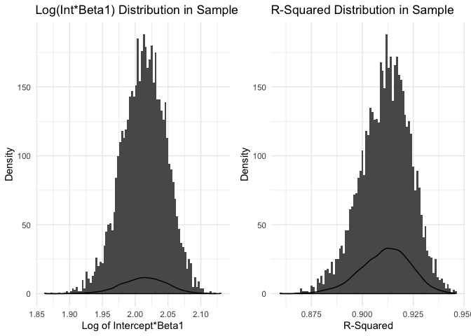

p8105\_hw6\_ps3070
================

``` r
library(tidyverse)
library(readxl)
library(knitr)
library(modelr)
library(p8105.datasets)

knitr::opts_chunk$set(echo = TRUE, warning = FALSE, out.width = "90%")

options(
  ggplot2.continuous.colour = "viridis",
  ggplot2.continuous.fill = "viridis"
)

scale_colour_discrete = scale_colour_viridis_d
scale_fill_discrete = scale_fill_viridis_d

theme_set(theme_minimal() + theme(legend.position = "bottom"))
```

### Problem 1

``` r
birthweight = read_csv(file = "./data/birthweight.csv") %>%
  janitor::clean_names() %>% 
  mutate(babysex = recode(babysex, "1" = "male", "2" = "female"),
         frace = recode(frace, "1" = "White", "2" = "Black", "3" = "Asian", "4" = "Puerto Rican", "8" = "Other", "9" = "Unknown"),
         mrace = recode(mrace, "1" = "White", "2" = "Black", "3" = "Asian", "4" = "Puerto Rican", "8" = "Other", "9" = "Unknown"),
         malform = recode(malform, "0" = "absent", "1" = "present"),
         babysex = as.factor(babysex),
         frace = as.factor(frace),
         mrace = as.factor(mrace),
         malform = as.factor(malform)
         )
```

``` r
birthweight %>% 
  map_df(~sum(is.na(.)))
```

    ## # A tibble: 1 x 20
    ##   babysex bhead blength   bwt delwt fincome frace gaweeks malform menarche
    ##     <int> <int>   <int> <int> <int>   <int> <int>   <int>   <int>    <int>
    ## 1       0     0       0     0     0       0     0       0       0        0
    ## # … with 10 more variables: mheight <int>, momage <int>, mrace <int>,
    ## #   parity <int>, pnumlbw <int>, pnumsga <int>, ppbmi <int>, ppwt <int>,
    ## #   smoken <int>, wtgain <int>

There is no missing data in the dataset.

### Regression model

The outcome is continuous, so I will use a linear regression model.

``` r
bwt_base = lm(bwt ~ babysex + gaweeks + blength + mheight + smoken, data = birthweight) #linear model

bwt_model = modelr::add_residuals(birthweight, bwt_base) #residuals
bwt_model = modelr::add_predictions(bwt_model, bwt_base)

bwt_model %>%
  ggplot(aes(x = pred, y = resid, color = resid)) +
  geom_point(alpha = 0.5)
```


### Comparing model to two others

**Model 1: One using length at birth and gestational age as predictors (main effects only)**

``` r
bwt1 =
  lm(bwt ~ blength + gaweeks, data = birthweight)
```

**Model 2: One using head circumference, length, sex, and all interactions (including the three-way interaction) between these**

``` r
bwt2 =
  lm(bwt ~ bhead + blength + babysex + bhead*blength + bhead*babysex + blength*babysex + blength*blength*babysex, data = birthweight)
```

Next, I produced RMSE density plots for each:

``` r
cv = crossv_mc(birthweight, 100) 

cv = cv %>% 
  mutate(base  = map(train, ~lm(bwt ~ babysex + gaweeks + blength + mheight + smoken, data = .x)),
         model1  = map(train, ~lm(bwt ~ blength + gaweeks, data = .x)),
         model2  = map(train, ~lm(bwt ~ bhead + blength + babysex + bhead*blength + bhead*babysex + blength*babysex + blength*blength*babysex, data = .x))
         ) %>% 
  mutate(rmse_base = map2_dbl(base, test, ~rmse(model = .x, data = .y)),
         rmse_1 = map2_dbl(model1, test, ~rmse(model = .x, data = .y)),
         rmse_2 = map2_dbl(model2, test, ~rmse(model = .x, data = .y)))

cv %>% 
  select(starts_with("rmse")) %>% 
  pivot_longer(
    everything(),
    names_to = "model", 
    values_to = "rmse",
    names_prefix = "rmse_") %>% 
  mutate(model = fct_inorder(model)) %>% 
  ggplot(aes(x = model, y = rmse, color = model)) + 
  geom_violin()
```


Based on the violin plot above, model 2 appears to be the best because its mean squared error (MSE) is lowest among the models. Model 2 is the model containing interaction terms.

### Problem 2

``` r
weather_df = 
  rnoaa::meteo_pull_monitors(
    c("USW00094728"),
    var = c("PRCP", "TMIN", "TMAX"), 
    date_min = "2017-01-01",
    date_max = "2017-12-31") %>%
  mutate(
    name = recode(id, USW00094728 = "CentralPark_NY"),
    tmin = tmin / 10,
    tmax = tmax / 10) %>%
  select(name, id, everything())
```

    ## file path:          /Users/priyankasrinivasan/Library/Caches/rnoaa/ghcnd/USW00094728.dly

    ## file last updated:  2019-09-26 10:25:42

    ## file min/max dates: 1869-01-01 / 2019-09-30

Simple linear regression with tmax as response, tmin as predictor.

-   Use 5000 bootstrap samples
-   Produce estimates of r^2 and log(β0∗β1) for each sample

``` r
set.seed(10)

boot_fx = function(df) {
  
  sample_frac(df, size = 0.5, replace = TRUE)
  
}

boot_df = tibble(
  number = 1:5000,
  strap = rerun(5000, boot_fx(weather_df))
  )

#log
result_df = boot_df %>% 
  mutate(model = map(strap, ~lm(tmax ~ tmin, data = .x)),
         results = map(model, broom::tidy)
  ) %>% 
  unnest(results) %>%
  select(number, model:estimate) %>% 
  pivot_wider(
    names_from = term,
    values_from = estimate) %>%
  janitor::clean_names() %>%
  mutate(log_int_tmin = log(intercept*tmin))

#r^2
r2_df = result_df %>%
  mutate(model_fit = map(model, broom::glance)) %>%
  unnest(model_fit) %>%
  janitor::clean_names() %>% 
  select(number:r_squared)
```

Plots:

``` r
result_df %>% 
  ggplot(aes(x = log_int_tmin)) +
  geom_histogram()
```



``` r
r2_df %>%
  ggplot(aes(x = r_squared)) +
  geom_histogram()
```


Distributions normal

Median log: 2.01

Median r2: 0.91

log CI: (1.94, 2.08)

log r2: (0.88, 0.93)
